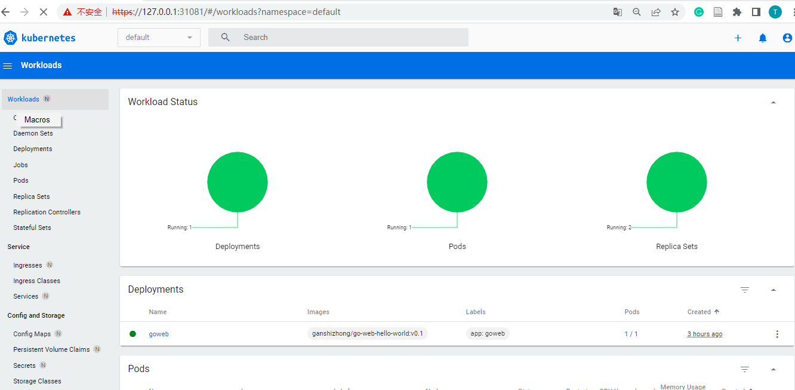

|主机|vm-host|备注|
|- |- | -|


## Task 1: Update system

按照要求，在官网下载`ubuntu18.04.6`镜像，采用 virtualbox 创建虚拟机(2C,2G)，并按要求设置端口转发规则。本地可通过`22222`端口ssh登陆虚拟机。具体结果如下图所示：


**虚拟机用户名：`gsz`；密码：`1234`**。登录虚拟机可替换镜像源，操作如下：
```sh
mv /etc/apt/sources.list /etc/apt/sources.list.bak
echo 'deb http://mirrors.163.com/ubuntu bionic main restricted
deb http://mirrors.163.com/ubuntu bionic-updates main restricted
deb http://mirrors.163.com/ubuntu bionic universe
deb http://mirrors.163.com/ubuntu bionic-updates universe
deb http://mirrors.163.com/ubuntu bionic multiverse
deb http://mirrors.163.com/ubuntu bionic-updates multiverse
deb http://mirrors.163.com/ubuntu bionic-backports main restricted universe multiverse
deb http://mirrors.163.com/ubuntu bionic-security main restricted
deb http://mirrors.163.com/ubuntu bionic-security universe
deb http://mirrors.163.com/ubuntu bionic-security multiverse' > /cat/etc/apt/sources.list

sudo apt-get update
```

## Task 2: install gitlab-ce version in the host

```sh
sudo apt update
sudo apt install ca-certificates curl openssh-server postfix
curl -LO https://packages.gitlab.com/install/repositories/gitlab/gitlab-ce/script.deb.sh

sudo bash script.deb.sh
sudo apt install gitlab-ce
```

> 初次登陆，初始密码在 `/etc/gitlab/initial_root_password` 文件中，任意用户名登陆即可。

**gitlab用户名：`root`；密码：`test1234`**

## Task 3: create a demo group/project in gitlab

登陆gitlab --> 创建group `demo` --> 创建project `go-web-hello-world` --> 添加文件 `hello.go`。如下图所示：


## Task 4: build the app and expose ($ go run) the service to 28081 port

登陆虚拟机，拉取代码，并运行，具体如下图所示：


> 虚拟机下访问gitlab 为`80`端口， 本地主机访问端口`28080`，为区分`task6`的端口8082，这里需要修改go文件的端口改为8081。

## Task 5: install docker

### 1）安装docker
```sh
apt install  ca-certificates  curl  gnupg  lsb-release
mkdir -p /etc/apt/keyrings
curl -fsSL https://download.docker.com/linux/ubuntu/gpg | sudo gpg --dearmor -o /etc/apt/keyrings/docker.gpg
echo "deb [arch=$(dpkg --print-architecture) signed-by=/etc/apt/keyrings/docker.gpg] https://download.docker.com/linux/ubuntu \
  $(lsb_release -cs) stable" | sudo tee /etc/apt/sources.list.d/docker.list > /dev/null
apt-get install docker-ce docker-ce-cli containerd.io docker-compose-plugin
```

### 2）在gitlab项目中，添加Dockerfile文件，内容如下：

```dockerfile
FROM golang:alpine 
WORKDIR "/app" 
COPY hello.go /app/hello.go
RUN go build hello.go
EXPOSE 8082
ENTRYPOINT ["./hello"]
```

### 3）编译Dockerfile，创建docker镜像，并启动容器

```sh
docker build -t goweb .
docker run -d -p 8083:8082  --name goweb goweb # 此处虚拟机的8082端口被占用，替换为80883
```

### 4）访问go应用，如下图所示：


## Task 7: push image to dockerhub

```sh
docker login # 登陆自己的账户

## 上传
docker tag goweb ganshizhong/go-web-hello-world:v0.1
docker push ganshizhong/go-web-hello-world:v0.1

## 下载
docker pull ganshizhong/go-web-hello-world:v0.1
```

## Task 8: document the procedure in a MarkDown file


## Task 9: install a single node Kubernetes cluster using kubeadm

```sh
sudo apt-get update
sudo apt-get install -y apt-transport-https ca-certificates curl
## 禁用 swap
vi /etc/fstab # 注释swap那一行，重启
free -m # 全为0即可
kubeadm init --image-repository=registry.aliyuncs.com/google_containers 
systemctl restart kubelet
```

## Task 10: deploy the hello world container

修改`cat /etc/kubernetes/manifests/kube-apiserver.yaml`文件，添加如下，因为`nodePort`默认为30000以下：
```yml
...
 - --service-cluster-ip-range=10.96.0.0/12
 - --service-node-port-range=1-65535 # 增添此行
...
```

```sh
# 
docker login # 貌似不是从本地下载的，需要先登录

# master单节点 无法创建，先进行如下操作
kubectl describe node demo |grep Taint

        Taints:             node-role.kubernetes.io/control-plane:NoSchedule
        taint node demo node-role.kubernetes.io/control-plane:NoSchedule-
        node/demo untainted
        describe node demo |grep Taint
        Taints:             <none>

kubectl create deployment goweb --image=ganshizhong/go-web-hello-world:v0.1

# kubectl expose deployment goweb --port=31080 --type=NodePort # 修改端口类型
kubectl edit svc goweb # 修改 goweb的配置文件
```
`kubectl edit svc goweb` 修改**type: ClusterIP**为**NodePort**,推出保存后再打开，会自动产生**nodePort**，并给了随机值，修改为指定端口`31080`
```yml
apiVersion: v1
kind: Service
metadata:
  creationTimestamp: "2022-09-16T02:38:43Z"
  labels:
    app: goweb
  name: goweb
  namespace: default
  resourceVersion: "30824"
  uid: a9c5fab5-3c4a-49b7-bb80-cdbb58e72e3d
spec:
  clusterIP: 10.111.191.86
  clusterIPs:
  - 10.111.191.86
  externalTrafficPolicy: Cluster
  internalTrafficPolicy: Cluster
  ipFamilies:
  - IPv4
  ipFamilyPolicy: SingleStack
  ports:
  - nodePort: 31080 # 修改为31080，自动成圣为51828
    port: 31080
    protocol: TCP
    targetPort: 8082
  selector:
    app: goweb
  sessionAffinity: None
  type: NodePort # 将`ClusterIP`替换为 `NodePort` 会自动产生一个nodePort端口，修改即可
status:
  loadBalancer: {}
```
结果如下图所示：


## Task 11: install kubernetes dashboard

```sh
wget https://raw.githubusercontent.com/kubernetes/dashboard/v2.6.1/aio/deploy/recommended.yaml

# 安装
kubectl apply -f recommended.yaml


# 修改nodePort端口，
kubectl edit svc -n kubernetes-dashboard #
```

登陆访问，如下图示：


## Task 12: generate token for dashboard login in task 11

先创建 admin-user，然后生成token,复制后，即可完成登陆

```sh
kubectl apply -f cluster-admin.yml # 创建权限用户

kubectl -n kubernetes-dashboard create token admin-user # 生成token，其他方式不行，版本问题
```
